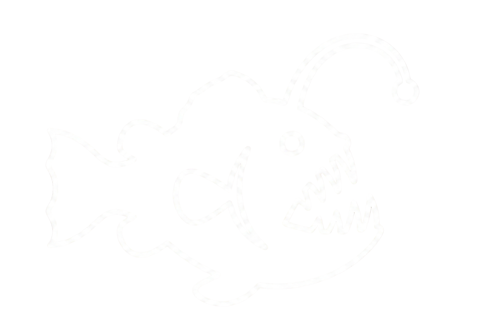

<div align="center">
  
  <h1>Anglerfish</h1>
</div>

[](https://github.com/vortacity/anglerfish/actions/workflows/ci.yml)

Deploy M365 canary tokens and detect unauthorized access: no callback URLs, no DNS beacons, no external infrastructure.

Anglerfish is a Python CLI that provisions deceptive artifacts (Outlook draft emails, SharePoint documents, OneDrive files) in Microsoft 365 tenants via the Graph API. When an attacker accesses a canary artifact, the M365 Unified Audit Log generates an event (`MailItemsAccessed`, `FileAccessed`) that your SIEM can alert on. Detection is entirely access-based; the canary never phones home.

> [!WARNING]
> **This tool is intended for security research, authorized testing, and defensive canary deployments only.**
> Always validate and test thoroughly in a non-production environment before deploying to any production tenant. Deploying untested canaries in production can result in unintended access events, alert fatigue, and artifacts that are difficult to clean up. See the [Legal Authorization Requirement](#legal-authorization-requirement) section before proceeding.

## How It Works

```text
1. Deploy     anglerfish → Graph API → canary artifact lands in M365
2. Trigger    attacker reads email / opens file → UAL audit event fires
3. Detect     SIEM queries UAL for artifact IDs from deployment record → alert
```

No HTTP callbacks, no DNS beacons, no embedded tracking pixels. The canary is a normal M365 object; detection relies on Microsoft's built-in audit pipeline.

## Key Features

- **Outlook canaries**: draft messages in hidden folders or sent to Inbox
- **SharePoint canaries**: deceptive files (.txt, .docx, .xlsx) uploaded to document libraries
- **OneDrive canaries**: deceptive files (.txt, .docx, .xlsx) uploaded to personal OneDrive for Business storage
- **Interactive + scripted CLI**: guided deployment or `--non-interactive` for CI/automation
- **YAML template system**: 16 bundled templates, custom template directories supported
- **Dry-run mode**: validate and authenticate without writing anything
- **Cleanup subcommand**: deterministic removal using deployment records
- **Monitor subcommand**: poll the M365 Management Activity API for canary access events
- **Verify subcommand**: confirm deployed canaries still exist via Graph API health checks
- **Dashboard subcommand**: full-screen TUI with canary status table, live alert feed, and stats bar
- **Graph API retry safety**: GET/DELETE retry on transient errors; POST/PUT do not auto-retry
- **Offline demo mode**: `--demo` flag for conference presentations without live tenant

## Differentiator

Unlike other canary token services that rely on DNS/HTTP beacons or external appliances, Anglerfish uses no callback infrastructure. Canary artifacts are native M365 objects. Detection is powered by the Unified Audit Log that enterprises already collect: no additional infrastructure, no network egress, no token-serving endpoints.

## Supported Canary Types

| Type | Delivery | Auth | Detection event |
|------|----------|------|-----------------|
| Outlook | Draft in hidden folder, or send to Inbox | Application | `MailItemsAccessed` |
| SharePoint | File upload to an existing site folder | Application | `FileAccessed`, `FileDownloaded` |
| OneDrive | File upload to personal OneDrive for Business | Application | `FileAccessed`, `FileDownloaded` |

## Scope Warning

> **`Mail.ReadWrite` is an application-level permission that grants access to ALL mailboxes in the tenant.** Grant this permission only in dedicated security/canary tenants or ensure your organization's security team has reviewed and approved the scope. Use least-privilege: grant only the permissions required for the canary types you intend to deploy.

---

## Installation

### Prerequisites

- Python 3.10+
- Microsoft 365 tenant with E3/E5 (or equivalent with audit logging enabled)
- Azure AD (Entra ID) app registration with appropriate Graph API permissions

### Quickstart

```bash
bash scripts/quickstart.sh
```

### Manual Install

```bash
python3 -m venv .venv
source .venv/bin/activate
python -m pip install --upgrade pip
pip install -e ".[dev]"
```

### Azure AD App Registration

See [Demo Tenant Setup Guide](docs/demo-tenant-setup.md) for step-by-step instructions including app registration, permission grants, and admin consent.

### Required Graph Permissions

| Canary type | Permission | Type |
|-------------|-----------|------|
| Outlook (draft) | `Mail.ReadWrite` | Application |
| Outlook (send) | `Mail.ReadWrite`, `Mail.Send` | Application |
| SharePoint | `Sites.ReadWrite.All`, `Files.ReadWrite.All` | Application |
| OneDrive | `Files.ReadWrite.All` | Application |
| Monitor | `ActivityFeed.Read` | Application (Office 365 Management APIs) |

### Environment Variables

```bash
export ANGLERFISH_CLIENT_ID="<your-application-client-id>"
export ANGLERFISH_TENANT_ID="<your-tenant-id-guid>"
export ANGLERFISH_APP_CREDENTIAL_MODE="secret"
export ANGLERFISH_CLIENT_SECRET="<your-client-secret>"
```

Certificate mode is also supported (`ANGLERFISH_APP_CREDENTIAL_MODE=certificate`). See `.env.example` for all options.

### Verify Installation

```bash
anglerfish --version
anglerfish --dry-run --non-interactive --canary-type outlook \
  --template "Fake Password Reset" --target test@example.com --delivery-mode draft
```

---

## Usage

### Interactive Deployment

```bash
anglerfish
```

The CLI walks through canary type selection, template choice, target configuration, and confirmation before deploying.

### Non-Interactive / Scripted Deployment

```bash
anglerfish \
  --non-interactive \
  --canary-type outlook \
  --template "Fake Wire Transfer" \
  --target victim@contoso.com \
  --delivery-mode draft \
  --output-json ./deployment-record.json

anglerfish \
  --non-interactive \
  --canary-type sharepoint \
  --template "Employee Salary Bands" \
  --target HRSite \
  --folder-path "Compensation/Restricted" \
  --filename "2026_Salary_Bands_Engineering.txt" \
  --output-json ./deployment-record.json

anglerfish \
  --non-interactive \
  --canary-type onedrive \
  --template "VPN Credentials Backup" \
  --target j.smith@contoso.com \
  --folder-path "IT/Backups" \
  --filename "VPN_Config_GlobalProtect_Backup.txt" \
  --output-json ./deployment-record.json
```

### Batch Deployment

Deploy multiple canaries from a YAML manifest:

```bash
anglerfish batch manifest.yaml --output-dir ./records/
```

Manifest format:

```yaml
defaults:
  vars:
    company_name: "Contoso Ltd"

canaries:
  - canary_type: outlook
    template: "Fake Password Reset"
    target: cfo@contoso.com
    delivery_mode: draft
    vars:
      target_name: "Jane Chen"

  - canary_type: sharepoint
    template: "Employee Salary Bands"
    target: HRSite
    folder_path: "Compensation/Restricted"
    filename: "2026_Salary_Bands_Engineering.txt"

  - canary_type: onedrive
    template: "VPN Credentials Backup"
    target: j.smith@contoso.com
    folder_path: "IT/Backups"
    filename: "VPN_Config_GlobalProtect_Backup.txt"
```

Authenticates once, deploys all entries sequentially, writes one deployment record per canary to `--output-dir`. Failures are logged and skipped; remaining canaries still deploy.

Dry run: `anglerfish batch manifest.yaml --dry-run`

Demo: `anglerfish batch manifest.yaml --demo`

### Dry Run

Validate configuration and authenticate without performing any writes:

```bash
anglerfish \
  --non-interactive \
  --dry-run \
  --canary-type sharepoint \
  --template "Employee Salary Bands" \
  --target HRSite \
  --folder-path "Compensation/Restricted" \
  --filename "2026_Salary_Bands_Engineering.txt"
```

### Listing Deployments

```bash
anglerfish list
anglerfish list --records-dir ~/.anglerfish/records
```

### Cleanup / Rollback

Use the deployment record from `--output-json`:

```bash
anglerfish cleanup ./deployment-record.json
```

Non-interactive cleanup:

```bash
anglerfish cleanup --non-interactive ./deployment-record.json
```

Deletion behavior:

| Canary type | Deletion endpoint | Result |
|-------------|-------------------|--------|
| Outlook draft | `DELETE /users/{upn}/mailFolders/{folder_id}` | Permanent (folder + draft message) |
| Outlook send | `DELETE /users/{upn}/mailFolders/inbox/messages/{id}` | Moves to Deleted Items |
| SharePoint | `DELETE /sites/{site_id}/drive/items/{item_id}` | Recycle bin behavior |
| OneDrive | `DELETE /users/{upn}/drive/items/{item_id}` | Recycle bin behavior |

### Demo Mode (Offline)

Run the CLI without a live M365 tenant, useful for conference demos or local testing:

```bash
# List pre-staged fixture records
anglerfish --demo list --records-dir examples/demo-records/

# Simulated interactive deployment (no auth, no writes)
anglerfish --demo

# Simulated cleanup
anglerfish --demo cleanup examples/demo-records/outlook-draft-record.json

# Simulated monitoring alert
anglerfish monitor --demo

# Dashboard with simulated data
anglerfish dashboard --demo

```

### Monitoring

Poll the Office 365 Management Activity API for canary access events:

```bash
# Continuous monitoring (polls every 5 minutes)
anglerfish monitor --records-dir ~/.anglerfish/records

# Single poll
anglerfish monitor --records-dir ~/.anglerfish/records --once

# Custom interval, exclude your own app ID
anglerfish monitor --records-dir ~/.anglerfish/records \
  --interval 60 \
  --exclude-app-id "your-app-client-id"

# With Slack alerting
anglerfish monitor --records-dir ~/.anglerfish/records \
  --slack-webhook-url https://hooks.slack.com/services/T.../B.../xxx
```

### Canary Health Check

Verify that deployed canaries still exist:

```bash
# Check a single record
anglerfish verify ./deployment-record.json

# Check all records in default directory
anglerfish verify

# Check all records in a specific directory
anglerfish verify --records-dir ~/.anglerfish/records/

# Demo mode (simulated output)
anglerfish verify --demo
```

Exit code 0 if all canaries are OK, 1 if any are GONE or ERROR.

### Dashboard (Live TUI)

Full-screen terminal dashboard showing canary status, live alert feed, and summary stats:

```bash
# Demo mode (simulated data, no auth required)
anglerfish dashboard --demo

# Live mode with default intervals (polls every 5 minutes)
anglerfish dashboard --records-dir ~/.anglerfish/records

# Custom intervals and alert log
anglerfish dashboard \
  --records-dir ~/.anglerfish/records \
  --poll-interval 60 \
  --verify-interval 120 \
  --alert-log ./alerts.jsonl \
  --exclude-app-id "your-app-client-id"
```

Key bindings: **q** to quit, **r** to manual refresh.

### Custom Templates

Built-in templates are loaded from package data. Custom templates directory:

```bash
export ANGLERFISH_TEMPLATES_DIR="/absolute/path/to/templates"
```

Expected layout:

```text
<custom-dir>/
├── outlook/
│   └── *.yaml
├── sharepoint/
│   └── *.yaml
└── onedrive/
    └── *.yaml
```

See [CONTRIBUTING.md](CONTRIBUTING.md) for template schema documentation.

## CLI Reference

### Global Flags (deploy command)

| Flag | Description |
|------|-------------|
| `--non-interactive` | Skip prompts |
| `--canary-type` | `outlook`, `sharepoint`, or `onedrive` |
| `--template` | Template name (case-insensitive) |
| `--target` | Mailbox UPN/email (Outlook), site name (SharePoint), or UPN (OneDrive) |
| `--delivery-mode` | `draft` or `send` (Outlook only) |
| `--folder-path` | SharePoint or OneDrive destination folder path |
| `--filename` | SharePoint or OneDrive filename |
| `--var KEY=VALUE` | Template variable override (repeatable) |
| `--dry-run` | Authenticate and validate without write calls |
| `--output-json` | Write deployment record JSON |
| `--demo` | Run in offline demo mode (no auth, no API calls) |
| `--tenant-id` | Microsoft Entra tenant ID (overrides `ANGLERFISH_TENANT_ID`) |
| `--client-id` | Microsoft Entra application (client) ID (overrides `ANGLERFISH_CLIENT_ID`) |
| `--credential-mode` | Credential type: `auto`, `secret`, or `certificate` |
| `-v, --verbose` | Enable debug logging for API calls and auth flow |

### Subcommands

| Command | Description |
|---------|-------------|
| `list` | List deployed canary artifacts |
| `list --records-dir DIR` | Records directory (default: `~/.anglerfish/records`) |
| `cleanup <record>` | Remove a deployed canary artifact using its deployment record |
| `cleanup --non-interactive` | Skip confirmation prompt |
| `monitor` | Poll audit logs for canary access events |
| `monitor --once` | Poll once and exit |
| `monitor --interval N` | Poll interval in seconds (default: 300) |
| `monitor --exclude-app-id ID` | Exclude app IDs from matching (repeatable) |
| `monitor --slack-webhook-url URL` | Slack incoming webhook URL for alert notifications |
| `monitor --alert-log PATH` | JSONL file to append alert records to |
| `monitor --no-console` | Suppress Rich console output (daemon mode) |
| `monitor --demo` | Print a simulated alert and exit (no auth required) |
| `batch <manifest>` | Deploy multiple canaries from a YAML manifest |
| `batch --output-dir DIR` | Output directory for deployment records (default: `~/.anglerfish/records`) |
| `batch --dry-run` | Validate manifest and authenticate without deploying |
| `batch --demo` | Run with simulated data (no auth, no API calls) |
| `verify [RECORD]` | Check deployed canaries still exist via Graph API |
| `verify --records-dir DIR` | Directory of records to verify (default: `~/.anglerfish/records`) |
| `dashboard` | Full-screen TUI with canary status, live alerts, and stats |
| `dashboard --demo` | Run with simulated data (no auth required) |
| `dashboard --poll-interval N` | Audit log poll interval in seconds (default: 300) |
| `dashboard --verify-interval N` | Health check refresh interval in seconds (default: 300) |
| `dashboard --alert-log PATH` | JSONL alert log file (loads history on startup) |
| `dashboard --exclude-app-id ID` | App/client IDs to exclude from matching (repeatable) |

## Reliability Notes

- Graph retries are side-effect-safe by default:
  - `GET` and `DELETE` retry on transient network errors, `429`, and `5xx`.
  - `POST` and `PUT` do not auto-retry unless explicitly marked safe in code.
- Deployment record writes (`--output-json`) are atomic (temp file + replace) to reduce partial-write risk.
- Deployment record reads require a JSON object with `timestamp` and `canary_type` (or legacy `type`).

## Legal Authorization Requirement

> [!CAUTION]
> **Do not deploy canaries without explicit written authorization.**
>
> Deploying canary artifacts in a Microsoft 365 tenant you do not own or administer without permission may violate computer fraud and unauthorized access laws in your jurisdiction. Before deploying Anglerfish in any environment:
>
> - **Obtain written authorization** from the asset owner and the organization that owns the tenant. Verbal approval is not sufficient.
> - **Consult your legal department.** Laws governing monitoring, deception, and access to computer systems vary by country, state, and industry. Your legal team must review and approve the deployment before you proceed.
> - **Notify your security and compliance stakeholders.** SOC teams, privacy officers, and HR may have standing policies that govern this type of activity.
> - **Never deploy in a tenant you do not have explicit authority over**, including client environments, partner tenants, or shared infrastructure, without a signed agreement and legal review.
>
> This tool is intended for authorized security testing, red team operations, and defensive canary deployments by teams with proper authorization. Misuse is the sole responsibility of the operator.

## Safety Checklist

- [ ] **Written authorization obtained from asset owner before deploying to production**
- [ ] Legal department consulted and deployment approved
- [ ] SOC / detection team notified of canary type, template, and target
- [ ] App registration created with least-privilege permissions
- [ ] `--output-json` path specified so the record is saved for later cleanup
- [ ] Cleanup plan documented (who, when, `anglerfish cleanup <record>`)
- [ ] Test in a non-production tenant first
- [ ] Do not commit secrets, certs, or tokens

See [threat-model.md](docs/threat-model.md) for the full deployment checklist and permissions reference.

## Validation

```bash
.venv/bin/python -m pytest -q
.venv/bin/ruff check src tests
```

## License

MIT. See [LICENSE](LICENSE).

## Changelog

See [CHANGELOG.md](CHANGELOG.md).
